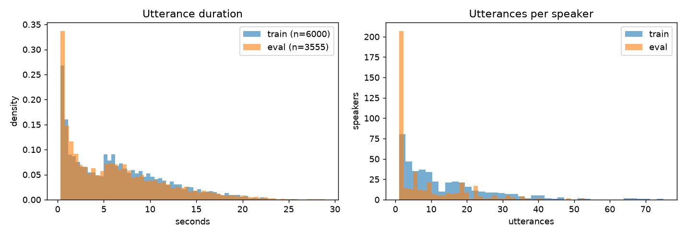
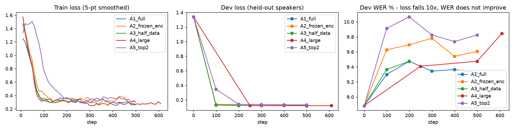

# Fine-tuning Bodhan Indic-Transcribe-core on Marathi (IndicVoices)

End-to-end fine-tuning of **`bodhan-ai/indic-transcribe-core`** (1.2B Canary-style ASR) on **IndicVoices-Marathi**, run entirely on Modal H100s, with a baseline, three ablations, subgroup analysis and a manual error analysis.

> **TL;DR:** The pipeline works end to end: data audit → speaker-disjoint splits → smoke test → baseline → 5 fine-tuning ablations on parallel H100s → evaluation from reloaded checkpoints → error analysis. **No fine-tuned variant beat the base model** (base WER 12.33 / CER 4.24; the best fine-tuned run, A4 with 136 h, is at 12.83 / 4.42). The ablations explain why. Dev *loss* falls 10× in 100 steps while dev *WER* rises, so the model is mostly learning IndicVoices' transcription conventions. The damage lands on short conversational backchannels (हां→हो, अच्छा→ओके), and it shrinks steadily as distinct training data grows (3k → 6k → 69k utterances: 13.38 → 13.11 → 12.83).
>
> **Artifacts (checkpoints, full logs, predictions):** see the Google Drive link in the submission email (best checkpoint `A4_large.nemo`, run logs, all predictions)

## 1. Objective

Get a fine-tuning run of a Bodhan ASR model working end to end on Marathi, and measure the result honestly. That means a fixed eval set that no training decision touches, speakers kept separate between splits, the base model scored on the same set, and analysis of *where* the change comes from rather than a single number. There was one day to do it, so every choice below favours "small, correct, reproducible" over "big".

## 2. Model: `indic-transcribe-core`, fine-tuned through NeMo

| | |
|---|---|
| Architecture | FastConformer encoder (32L, 811M) + Transformer decoder (24L, 419M), Canary-1b-v2 lineage |
| Output | Native script only, prompt-conditioned (`source_lang`, `target_lang`, `pnc`) |
| Why *core* and not *flex* | IndicVoices references are **native-script only**: every English loanword is written in Devanagari (e.g. ऑर्डर, फ्लॉवर्स, अमेझॉन). Flex's selling point (Latin-script code-mixing) would never be supervised by this data. Core's output convention matches the ground truth. |
| Why NeMo | The HF `trust_remote_code` class is inference-only. Training uses the shipped `.nemo` checkpoint with NeMo's own `EncDecMultiTaskModel`, lhotse dataloader and Lightning loop. |

## 3. Dataset: `ai4bharat/IndicVoices`, Marathi config

We chose it over Shrutilipi (AIR news) because it has an official `valid` split and speaker/scenario metadata, and because it is mostly *spontaneous* speech (conversation and extempore), which is the realistic, hard case for Indic ASR. Licence: CC-BY-4.0.

**Budget decision:** the Marathi train split is 72 parquet shards (~470k utterances). We use **3 shards spread across the split (3, 27, 51)** as the train pool, which is enough for a 6k-utterance run and keeps download and preprocessing to minutes.

### Profile (`results/profile.json`, `results/data_profile.png`)

| | eval (official `valid`) | train pool (3 shards) |
|---|---|---|
| raw examples | 3,679 | 12,470 |
| removed | 124 | 4,211 |
| valid examples | **3,555** | 8,259 |
| raw hours | 6.15 | 23.04 |

| split | utts | hours | median / min / max dur (s) | speakers | read / extempore / conversation |
|---|---|---|---|---|---|
| train | 6,000 | 10.92 | 5.78 / 0.30 / 25.7 | 438 | 595 / 3,054 / 2,351 |
| train_half | 3,000 | 5.40 | 5.63 / 0.30 / 25.7 | 397 | 296 / 1,528 / 1,176 |
| dev | 275 | 0.61 | 7.17 / 0.35 / 23.0 | 23 | 37 / 207 / 31 |
| eval | 3,555 | 6.03 | 5.06 / 0.30 / 28.9 | 435 | 204 / 1,273 / 2,078 |

**Scale-up pool for A4** (`results/profile_large.json`): 24 shards (every 3rd), 99,754 raw → **69,059 valid utterances, 136.1 h, 1,077 speakers** (extempore 39.7k / conversation 22.6k / read 6.7k). Removed: 28,603 eval/dev-speaker rows, 1,288 tag rows, 476 duration, 306 annotator-flagged, 22 rate outliers. Each shard is processed in its own CPU container, in parallel.

Text: a median of 11–12 words per utterance. The training vocabulary has 15.8k word types. **14% of eval word tokens are out-of-vocabulary with respect to the 6k training set**, so improvement has to come from sub-word generalisation, not memorised words.
Speaker overlap after the steps below: **train∩eval = 0, train∩dev = 0, dev∩eval = 0.**



## 4. Data preparation (`src/data.py`)

1. **The official split is not speaker-disjoint.** Checking `speaker_id` showed that **3,885 of the 12,470 train-pool rows (31%) come from speakers who are also in `valid`.** Training on them would leak speaker identity into the eval set, so they are removed from training (eval is left untouched).
2. **Asymmetric filtering.** Eval only drops rows that *cannot be scored*. Train additionally drops rows whose transcript is probably wrong. Cleaning the test set to make it easier is avoided on purpose.

| filter | eval | train pool | why |
|---|---|---|---|
| `annotation_tag` (`<unintelligible>`-style tags in text) | 59 | 162 | not scorable and not learnable; these tags are the *only* Latin text in the corpus |
| duration outside 0.3–30 s | 65 | 98 | sub-0.3 s clips carry no speech; the model trains on ≤30 s |
| non-Devanagari characters | 0 | 0 | check for the native-script assumption, which held on the full split |
| speaking-rate outlier (>25 chars/s, or <1 char/s on >5 s clips) | – | 5 | likely truncated or misaligned transcripts |
| annotator flags (`unclear_audio`, `wrong_language`, `skipping_words`, `incorrect_text_prompt`) | – | 61 | the annotators' own verification report says audio and text may not match |
| speaker also in eval | – | 3,885 | leakage (see 1) |

3. **Speaker-disjoint dev.** 5% of train-pool *speakers* (23 speakers, 275 utterances) are held out for validation loss. `valid` is never used to make a training decision.
4. **Nested data-size ablation set.** `train_half` is the first 3,000 rows of the seeded, shuffled `train`, so A3 sees a strict subset of what A1 sees.
5. **Manifest schema.** Canary-2 is a prompted multi-task model, so each line carries `source_lang=mr`, `target_lang=mr`, `pnc=no`, `taskname=asr`, the transcript under `answer` (and `text`), and the metadata fields for subgroup analysis. `pnc=no` is used because IndicVoices references have no punctuation.
6. Audio is decoded from parquet bytes, downmixed to mono and resampled to 16 kHz WAV.

## 5. Training (`src/train.py`, `configs/train.yaml`)

We use NeMo's model class, lhotse dataloader and optimiser setup. The loop runs in-process rather than through `speech_to_text_finetune.py`, so each ablation is just a dict override.

| setting | value | why |
|---|---|---|
| optimiser | AdamW, lr 1e-5, wd 1e-3, betas (0.9, 0.98) | strong pretrained model and small in-domain set, so a small step size avoids catastrophic forgetting |
| schedule | 50 warmup steps, cosine to lr/20 | standard for fine-tuning |
| steps | 500 (~5 passes over 6k utterances) | fits comfortably in the time budget; val loss every 100 steps shows whether more would help |
| batching | lhotse dynamic, 360 s of audio per batch, no bucketing | simple; the 2D bucketing from the Canary recipe is tuned for their data mix |
| precision | bf16-mixed on 1×H100 | |
| grad clip | 1.0 | |
| logging | CSV: train loss, val loss, lr per step; `run_info.json`: runtime, peak GPU memory, trainable params | |

### Ablations (one H100 each, run in parallel)

| run | change vs A1 | question it answers |
|---|---|---|
| A0 base | no fine-tuning | the reference point |
| A1_full | main run: full fine-tune, 6k utts, 500 steps | does in-domain fine-tuning help at all? |
| A2_frozen_enc | encoder frozen (419M of 1.2B trainable) | is the gain acoustic (encoder) or linguistic/format (decoder)? |
| A3_half_data | 3k utts (nested subset), 250 steps (same epochs) | how much does data volume matter at this scale? |
| A4_large | 24 shards (69k utts / 136 h), time-boxed to 22 min | does scaling data help beyond A1 at a similar compute budget? |
| A5_top2 | only last 2 encoder + last 2 decoder layers + head trainable | does limiting capacity prevent the forgetting seen in A1/A2? |

`trainer.validate()` runs *before* `fit()`, so every dev-loss curve starts from the base model's value.

### Smoke test (`src/smoke_test.py`)

Runs **the same `train.run`** as the real runs on 16 utterances for 3 steps. It then saves the `.nemo`, reloads it from disk, asserts that decoder weights changed, and transcribes 4 clips from the reloaded checkpoint. This covers load → processor/tokenizer → collate → forward → loss → backward → step → checkpoint → reload → inference.

## 6. Evaluation (`src/evaluate.py`, `src/text.py`)

* **Set:** official `valid` minus unscorable rows. 3,555 utterances, 6.0 h, 435 speakers, none seen in training. The same set is used for every run.
* **Metrics:** WER and CER (jiwer), reported two ways:
  * **raw:** NFC plus whitespace collapse only;
  * **normalized:** also strips punctuation (incl. `।`), zero-width joiners (ZWNJ/ZWJ are common in Marathi, e.g. `प्रिंटस्‌`) and case.
  The gap between the two shows how much of a "WER" number is formatting rather than recognition.
* **Subgroups (normalized):** register (read vs spontaneous), scenario, duration bucket (<2 s / 2–10 s / >10 s), gender.
* Fine-tuned models are evaluated from the **reloaded `.nemo`**, not the in-memory model, which proves the saved artifact works.

## 7. Results

All numbers are on the same 3,555-utterance eval set (6.0 h, 435 speakers, none seen in training). Fine-tuned models are scored from their **reloaded** `.nemo`. WER and CER are in %; "CER no-space" ignores word segmentation.

| run           |   WER raw |   CER raw |   WER norm |   CER norm |   CER no-space |   WER read |   WER spont. | trainable M   | train min   | peak GB   |
|:--------------|----------:|----------:|-----------:|-----------:|---------------:|-----------:|-------------:|:--------------|:------------|:----------|
| base          |     12.33 |      4.24 |      12.33 |       4.24 |           4.39 |       5.95 |        12.81 | -             | -           | -         |
| A1_full       |     13.11 |      4.56 |      13.11 |       4.56 |           4.71 |       7.19 |        13.55 | 1221          | 10.2        | 61.5      |
| A2_frozen_enc |     13.99 |      5.02 |      13.99 |       5.02 |           5.15 |       8.2  |        14.42 | 410           | 11.1        | 17.7      |
| A3_half_data  |     13.38 |      4.68 |      13.38 |       4.68 |           4.8  |       8.01 |        13.78 | 1221          | 7.8         | 57.3      |
| A4_large      |     12.83 |      4.42 |      12.83 |       4.42 |           4.58 |       7.83 |        13.2  | 1221          | 26.6        | 54.9      |
| A5_top2       |     14.37 |      5.06 |      14.37 |       5.06 |           5.14 |       8.35 |        14.82 | 84            | 13.8        | 12.8      |



### What the ablations say

* **Fine-tuning hurt, and loss hid it.** Every run's dev loss drops from 1.34 to about 0.12 within 100 steps, yet dev WER goes *up* (8.9 → 9.3–9.9), and eval WER follows. A tenfold loss drop with no recognition gain means the model is fitting the *reference format* under teacher forcing. My hypothesis is prompt/format tokens and IndicVoices' verbatim spelling conventions, which a strong model already mostly decodes correctly. **Checkpoint selection on dev loss would have been actively misleading.** This is the main lesson of the project.
* **Data volume is the strongest lever.** A3 (3k) 13.38 → A1 (6k) 13.11 → A4 (69k utts / 136 h) 12.83, with the gap to base shrinking at each step. A4 fully repaired the short-clip regression (19.84 vs base 19.7) despite being time-capped at 609 steps, *less than half an epoch*. At a fixed compute budget, more distinct data beats more passes over the same data.
* **Freezing the encoder was the worst option (A2, 13.99).** If the problem were acoustic drift, freezing the encoder would help. It did the opposite: with only the decoder trainable, all adaptation goes into the language-model prior, which is exactly the component that broke (backchannel substitutions, Hindi intrusion). Freezing the encoder also cut peak memory from 61.5 GB to 17.7 GB, a useful fact for cheaper hardware.
* **Unfreezing only the top layers was worst of all (A5, 14.37; 84M of 1.22B trainable, 12.8 GB peak).** The intuition was that limiting capacity would limit forgetting. The result says the opposite for *where* the capacity sits: the less the network below the output can move, the more the adaptation concentrates in the output-side prior, and the short-clip bucket collapses (33.05 WER vs 19.7 base). The ordering A4 < A1 < A3 < A2 < A5 is consistent: **full-network fine-tuning with more distinct data was least harmful, and output-concentrated adaptation was most harmful.** The next experiment is not fewer layers but a lower learning rate, or LoRA across all layers with early stopping on dev WER.
* **Raw vs normalized scoring made no difference** (identical to 2 decimals). With the `pnc=no` prompt the model emits no punctuation, digits or Latin script, so normalization had nothing to remove. The segmentation-invariant CER is ~0.15 points above CER, so a small but real share of errors is word-boundary convention (अशाप्रकारचे vs अशा प्रकारचे).

### Targeted analysis: does fine-tuning help spontaneous more than read speech?

Hypothesis (fixed before training): fine-tuning on IndicVoices, which is 91% spontaneous speech, would help spontaneous speech more than read speech.

| axis       | group        |    n |   WER base |   WER A4_large |   ΔWER |
|:-----------|:-------------|-----:|-----------:|---------------:|-------:|
| register   | read         |  204 |       5.95 |           7.83 |   1.88 |
| register   | spontaneous  | 3351 |      12.81 |          13.2  |   0.39 |
| scenario   | Conversation | 2078 |      16.07 |          16.38 |   0.31 |
| scenario   | Extempore    | 1273 |       9.85 |          10.32 |   0.47 |
| scenario   | Read         |  204 |       5.95 |           7.83 |   1.88 |
| dur_bucket | long >10s    |  767 |      11.06 |          11.63 |   0.57 |
| dur_bucket | medium 2-10s | 1679 |      12.75 |          13.23 |   0.48 |
| dur_bucket | short <2s    | 1109 |      19.7  |          19.84 |   0.14 |
| gender     | Female       | 1846 |      11.33 |          11.86 |   0.53 |
| gender     | Male         | 1707 |      13.46 |          13.93 |   0.47 |
| gender     | Other        |    2 |       0    |           0    |   0    |

**Result: directionally supported in relative terms, refuted in absolute terms.** No subgroup improved. The cost, however, is lopsided: read speech lost the most (+1.88 WER) and spontaneous speech the least (+0.39). Fine-tuning pulled the model toward the training data's register, and the out-of-register slice paid for it. Caveat: read has only n=204. Conversation, the hardest slice (16% WER), was the most stable (+0.31).

**Contamination caveat:** Bodhan has not disclosed its pretraining data. Given the shared AI4Bharat lineage, the base model may already have seen IndicVoices, and the base model's low error on this set (and the "nothing left to learn but conventions" dynamic) is consistent with that. The base-vs-fine-tuned delta is therefore a *lower bound* on what fine-tuning can do on truly unseen data.

## 8. Error analysis

`results/error_analysis.csv` has 50 utterances: the 12 where fine-tuning helped most, the 12 where it hurt most, and 26 random remaining errors. Each has reference / base / fine-tuned text, per-utterance WER, and auto-tags as labelling hints (`very short ref`, `deletions`, `insertions/hallucination`, `word order`, `non-Devanagari output`). Categories were assigned after reading the examples, not beforehand.

**Base-model errors are mostly convention, not recognition.** In a random sample of base errors:

| category | example (reference → base) |
|---|---|
| spelling variant | किंमतींवर → किमतींवर, हा → हां |
| dialect written as spoken | तुमी → तुम्ही (the reference keeps the spoken form; the model standardises) |
| word segmentation | अशाप्रकारचे → अशा प्रकारचे; बघितलेली → बघितली ती |
| disfluency / false start | the reference keeps fragments (…महिलांच्या **साद** महिलां…, **र**); the model skips or regularises them |
| real misrecognition | शॉपवर → वापर (conversation, noisy) |

The base model already outputs **no punctuation, digits or Latin script** under the `pnc=no` prompt. That's why raw and normalized WER are identical, and why the space-insensitive CER is only slightly above plain CER.

**What fine-tuning broke: short conversational backchannels.** On clips under 2 s, 55 utterances got worse and 36 better. Each error weighs heavily because the references are 1–2 words, so WER on this bucket jumps from 19.7 to 26–28. The regressions follow one pattern: **the decoder's language-model prior drifts toward the most frequent backchannels in the training data.**

| reference | base | fine-tuned (A3) |
|---|---|---|
| हां | हां | हो |
| अच्छा | अच्छा | ओके |
| ठीक आहे | ठीक आहे | हो का |
| हां गोळ्या आहेत ना त्या | (correct) | हां गोव्या **इतना** ते ← Hindi intrusion |
| हॅलो नितीन बोलतो ना | (correct) | …बोलता ना ← verb-ending drift |
| चालेल चालेल चालेल | (correct) | चाल चाल चाल ← truncation |

With little acoustic evidence (under 2 s), the fine-tuned decoder falls back on its updated prior. Six thousand utterances are enough to shift that prior, but not enough to improve the acoustics. A5 tested the obvious fix, restricting which layers can move, and it made this worse (33.05 WER on clips under 2 s). The remedy is more distinct data (A4 fully recovered this bucket), lower learning rates, and early stopping on dev WER.

## 9. Problems encountered

1. **No HF training path.** The model card's "no NeMo needed" applies to inference only. Fine-tuning required the `.nemo` checkpoint and NeMo 2.7.
2. **Custom tokenizer.** The checkpoint config names `nemo.collections.common.tokenizers.canary_multilingual_tokenizer.CanaryMultilingualTokenizer`, which stock NeMo does not have. My first loader did a plain `import` of the file, which would not satisfy `restore_from`, because the class has to be registered *under NeMo's module path*. Reading the repo's `nemo/load_nemo.py` before touching a GPU caught this. We now call its `register_tokenizer()`.
3. **Gated access.** The model gate is per account, and the token in the Modal secret belonged to an account that hadn't accepted it yet (403 on the `.nemo` files, while the dataset worked). Diagnosed by printing `whoami()` from inside the container.
4. **Speaker leakage in the official split** (31% of the sampled train rows). See §4.
5. **Prompted-model manifest schema.** Canary needs `source_lang/target_lang/pnc` plus `answer`, not the usual `{audio_filepath, text}`. This was built into preprocessing from the start.
6. **Silent "training in eval mode" bug (the most instructive one).** The first A1–A3 launch printed `0 Modules in train mode, 1460 Modules in eval mode` in the Lightning summary. `model.load()` returns `.eval()` (right for inference), and Lightning ≥ 2.2 *preserves* a module's existing mode when `fit()` starts, instead of forcing `.train()`. The runs would have trained without SpecAugment or dropout: no crash, no warning, just a quietly different recipe. I stopped them about 10 minutes in, added `.train()` in `train.py`, and relaunched. The smoke test didn't catch this because loss still decreases in eval mode. Lesson: read the module summary, don't just check that loss goes down.
7. **Harmless scary log line.** `ERROR:hydra.utils: Error getting class at ...get_nemo_transformer` is printed on every restore, followed by `Model EncDecMultiTaskModel was successfully restored`. The decoder config names a factory function where hydra expects a class, and NeMo falls back. Ignored after verifying the restore and inference outputs.
8. **Smoke-test assertion bug.** My check compared `model.decoder` weights, but in Canary the attribute is `transf_decoder`. The test crashed *after* training, saving and reloading had all succeeded. It now compares all parameters (1,826 tensors changed after 3 steps).
9. **Orchestration.** `modal run --detach` keeps only the *last* triggered function alive, so fanning out from the local entrypoint would lose runs if the laptop disconnected. The fan-out now lives in a remote `ablations()` function. A first launch also passed the run *name* where `train.run` expected the override dict (`TypeError: 'str' object is not a mapping`). That was caught within seconds because every stage fails loudly.
10. **Training stalled at 0% GPU: a data-loading I/O trap.** After relaunching, 3 of 4 containers sat at 0% GPU with only the weights (5.4 GB) in memory. A `py-spy dump` inside the live container (`modal container exec`) showed the main process in `soundfile.info()`, called from NeMo's lhotse adapter `_create_recording → Recording.from_file`. When a manifest line has no `sampling_rate`, NeMo *opens every audio file* to read its header. With a 10k-item shuffle buffer, that means thousands of metadata reads on a network volume before the first batch: about 15 minutes for 6k files, and it would have been about 25 minutes for A4's 69k. Fix: write `sampling_rate: 16000` into every manifest line (`src/data.py`). NeMo then builds the `Recording` from the manifest alone. A3 got through because its 3k files fit in the time; A1, A2 and A4 were restarted with the fixed manifests. **The same trap hit evaluation.** `model.transcribe(list_of_paths)` writes its own temp manifest *without* `sampling_rate`, so base eval sat at 0% GPU for about 25 minutes probing 3,555 files. `transcribe()` now receives our manifest directly.
11. **Compute vs data scale.** A 6k-utterance subset is small next to the ~470k available. Multi-GPU DDP was ruled out: Lightning's DDP launcher re-executes the script, which doesn't work inside a Modal function, and debugging it wasn't worth the time budget. Instead, **A4 scales the data 8× (24 shards)**, prepared by 24 parallel CPU containers in minutes and trained on one H100 with 16 loader CPUs under a hard `max_time` cap (22 min). At a fixed compute budget, more *distinct* data beats more epochs over the same 6k.

## 10. What I'd do next

1. **Multi-reference / orthography-aware scoring.** Many base "errors" are legitimate spelling variants (किंमत/किमत, हा/हां), dialect forms written as spoken (तुमी vs तुम्ही) or segmentation (अशाप्रकारचे / अशा प्रकारचे). An OIWER-style metric, which Bodhan itself reports, would separate *recognition* gains from *convention-matching* gains. That's the most important caveat on every number here.
2. **Scale the A4 recipe properly.** Train multi-GPU (torchrun inside the container, or Modal's multi-node support) on all 72 shards, use NeMo's 2D bucketing to cut padding, and pick the checkpoint on dev WER, not dev loss. The A3 curve shows dev loss and dev WER disagree.
3. **Targeted conversation and short-utterance data.** Conversation (16% WER) and clips under 2 s (~20% WER) are where the base model is weakest. Up-weighting them during sampling, or adding context for backchannels such as हां/हो, attacks the actual failure mode instead of the average.

## Reproduce

```bash
pip install modal && modal setup
modal secret create huggingface HF_TOKEN=<token with access to the gated model + dataset>
modal run modal_app.py --stage prepare      # ~15 min, CPU: download, filter, manifests, profile
modal run modal_app.py --stage prepare_large  # 24 shards, one CPU container each (for A4)
modal run modal_app.py --stage smoke        # ~10 min, 1×H100
modal run modal_app.py --stage ablations    # base eval + A1..A4 in parallel, 1×H100 each
# (--only A4_large to launch a single run)
modal run modal_app.py --stage analyze      # tables, curves, error sheet
modal volume get marathi-asr results ./     # pull results
```

## Layout

```
configs/train.yaml      all hyper-parameters + ablation overrides
modal_app.py            the only entrypoint; images, volume, stages
src/data.py             IndicVoices -> filtered, speaker-disjoint Canary manifests
src/profile_data.py     dataset statistics + plots
src/model.py            load .nemo (custom tokenizer registration), transcribe
src/train.py            NeMo/Lightning fine-tuning, ablation = config override
src/smoke_test.py       3-step train -> save -> reload -> infer
src/evaluate.py         predictions.json + metrics.json (raw/normalized, subgroups)
src/analyze.py          ablation table, subgroup deltas, curves, error sheet
src/text.py             normalisation + WER/CER (self-test: python -m src.text)
results/                everything small; checkpoints/logs are on Google Drive
```
